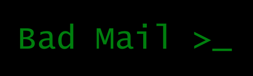

# BadMail
<p align="center">
  
</p>
## A responsibility
The author is not responsible for the damage caused by this program

## Some information
BadMail this is a mail/gmail spammer using smtp
* Coded on python
* Working on Windows and Linux
* Using a console arguments

## Installation
Installing libraries:

```pip install argparse```
```pip install colorama```
```pip install smtplib``` (If library not installing ignore)

Coping repository:
```git clone https://github.com/toxidworm/BadMail```

Starting Badmail:
```
cd BadMail
python badmail.py --help
```

## Usage
```python badmail.py --message "Test message" --subject "Some subject" --threads 30 --target someemaillol@gmail.com```

## Smtp's
smtp.gmail.com
smtp.yandex.ru
smtp.mail.ru

## Contact with author

Telegram:
@thecoffee_cup